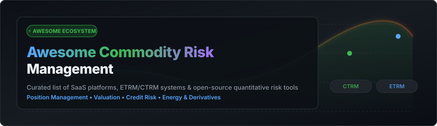

<p align="center">
  <a href="https://github.com/ishandutta2007/Awesome-Awesome-Awesome"></a>
  <a href="https://discord.gg/jc4xtF58Ve"></a>
  <a href="https://github.com/ishandutta2007/Awesome-Commodity-Risk-Management/stargazers"></a>
  <a href="https://github.com/ishandutta2007/Awesome-Commodity-Risk-Management/network/members"></a>
  <a href="https://github.com/ishandutta2007/Awesome-Commodity-Risk-Management/blob/main/LICENSE"></a>
  <a href="https://github.com/ishandutta2007"></a>
</p>

<p align="center">
  
</p>

# ⚡ Awesome Commodity Risk Management 📊

> **A curated ecosystem of SaaS platforms, enterprise CTRM/ETRM software, and open-source quantitative risk tools for energy, metals, power, and agricultural markets.**

Welcome to the ultimate reference guide for **Commodity Trading & Risk Management (CTRM)** and **Energy Trading & Risk Management (ETRM)** platforms. Whether you are evaluating commercial SaaS solutions or building open-source risk, pricing, and dispatch pipelines, this directory provides structured insights into market capabilities, pricing starting tiers, trial availability, and open quantitative libraries.

---

## 📋 Table of Contents
- [💡 Market Overview & Sector Analysis](#-market-overview--sector-analysis)
- [🏢 SaaS & Commercial CTRM/ETRM Platforms](#-saas--commercial-ctrmetrm-platforms)
- [💻 Open-Source GitHub Projects](#-open-source-github-projects)
- [📐 System Architecture Patterns](#-system-architecture-patterns)
- [🤝 How to Contribute](#-how-to-contribute)
- [⚖️ Disclaimer](#%EF%B8%8F-disclaimer)
- [📈 Star History](#-star-history)
- [💖 Support & Community](#-support--community)

---

## 💡 Market Overview & Sector Analysis

> 💡 **Market Insights**: The global Commodity Trading & Risk Management (CTRM/ETRM) software market size is estimated at **$2.1 Billion** (projected to reach **$3.8 Billion by 2032** at a 7.4% CAGR). The market structure is **moderately concentrated** at the enterprise tier with legacy consolidators (ION Group and FIS Global) commanding significant market share, while remaining **moderately fragmented** among modern cloud-native SaaS specialists, regional power grid dispatch providers, and boutique risk advisory platforms.

---

## 🏢 SaaS & Commercial CTRM/ETRM Platforms

The commercial CTRM/ETRM market is built around complex requirements such as physical logistics (pipe/vessel/rail dispatch), mark-to-market valuation, Value-at-Risk (VaR), credit risk, invoicing, and regulatory reporting (EMIR, Dodd-Frank, REMIT).

*Table sorted by **Company Size (Revenue / Valuation)** in descending order:*

| Platform / Vendor 🏢 | Focus & Key Capabilities ⚡ | Company Size (Revenue / Valuation) ⬇️ | Pricing Tier (Starting Price) 💰 | Free Tier / Trial Limits ⏳ |
| :--- | :--- | :--- | :--- | :--- |
| **[FIS Quantum](https://www.fisglobal.com/)** | Enterprise trading, treasury, and risk management with commodity & energy risk capabilities for multinational corporations. | **~$14.7B Revenue**<br>*(Public: NYSE FIS)* | **$50,000 / year**<br>*(Base platform fee for entry enterprise modules)* | No free forever plan;<br>**30-day enterprise sandbox evaluation** upon qualified inquiry |
| **[Calypso / Adenza](https://www.calypso.com/)** | Institutional capital markets and multi-asset risk platform covering energy, derivatives pricing, collateral, and complex commodity portfolios. | **~$6.5B Revenue**<br>*(Parent: Nasdaq / Adenza $10.5B Valuation)* | **$60,000 / year**<br>*(Minimum starting institutional licensing fee)* | No free forever plan;<br>**14-day interactive demo environment** with sample portfolios |
| **[ION Openlink / Allegro / Aspect / Triple Point](https://iongroup.com/)** | Flagship CTRM & ETRM ecosystem (Openlink Endur, Allegro Horizon, AspectCTRM) for physical/financial oil, gas, power, and metals trading. | **~$2.5B Revenue**<br>*(Valuation: ~$15B+)* | **$35,000 / year**<br>*(Starting tier for targeted physical trading modules)* | No free forever plan;<br>**30-day proof-of-concept trial** upon formal vendor request |
| **[Energy One](https://www.energyone.com/)** | Wholesale energy trading, power scheduling, dispatch automation, and ETRM software tailored for European and APAC power markets. | **~$33M USD Revenue**<br>*(Market Cap: ~$100M USD / ASX: EOL)* | **$2,500 / month**<br>*(Starting subscription for power dispatch & trading)* | No free forever plan;<br>**14-day guided sandbox trial** (up to 5 active users) |
| **[Molecule Software](https://molecule.io/)** | Modern, cloud-native ETRM/CTRM for power, gas, crude, and renewable credits with automated deal capture, real-time VaR, and API integration. | **~$15M – $25M Revenue**<br>*(Valuation: ~$60M / Series B)* | **$1,500 / month**<br>*(Starting package for Fund/Core edition)* | No free forever plan;<br>**14-day cloud sandbox trial** with test datasets |
| **[Enuit (ENTRADA CTRM)](https://www.enuit.com/)** | Multi-commodity trade capture, risk management, logistics, settlement, and accounting platform for energy, LNG, and metals. | **~$15M – $20M Revenue**<br>*(Private CTRM vendor)* | **$3,000 / month**<br>*(Base tier for physical commodity trade capture & risk)* | No free forever plan;<br>**30-day guided evaluation environment** |
| **[Value Creed](https://www.valuecreed.com/)** | Specialized CTRM managed services, cloud operations, run-state management, and custom CTRM risk analytics extensions. | **~$10M – $15M Revenue**<br>*(Private CTRM services provider)* | **$2,000 / month**<br>*(Starting fee for managed CTRM operations & analytics)* | No free forever plan;<br>**14-day trial environment** for managed risk dashboards |

---

## 💻 Open-Source GitHub Projects

While end-to-end production CTRM/ETRM systems are predominantly commercial due to accounting and regulatory complexity, open-source libraries provide critical building blocks for quantitative valuation, volatility curve modeling, power system dispatch, and portfolio risk optimization.

*List sorted by **GitHub Stars** in descending order:*

1. **[SciPy](https://github.com/scipy/scipy)** — [](https://github.com/scipy/scipy/stargazers)  
   *Fundamental algorithms for scientific computing, interpolation, optimization, and numerical integration used in commodity curve building and pricing algorithms.*

2. **[statsmodels](https://github.com/statsmodels/statsmodels)** — [](https://github.com/statsmodels/statsmodels/stargazers)  
   *Comprehensive statistical modeling, linear regression, time-series analysis (ARIMA, VAR), and econometric tools for commodity price forecasting and cointegration testing.*

3. **[QuantLib](https://github.com/lballabio/QuantLib)** — [](https://github.com/lballabio/QuantLib/stargazers)  
   *The gold standard open-source quantitative finance library for derivatives pricing, term-structure curve construction, yield curves, and Monte Carlo simulation adaptable to commodity options.*

4. **[CVXPY](https://github.com/cvxpy/cvxpy)** — [](https://github.com/cvxpy/cvxpy/stargazers)  
   *Domain-specific language for convex optimization in Python, widely applied in commodity storage scheduling, inventory optimization, and portfolio hedging.*

5. **[Riskfolio-Lib](https://github.com/dcajasn/Riskfolio-Lib)** — [](https://github.com/dcajasn/Riskfolio-Lib/stargazers)  
   *Quantitative portfolio optimization library in Python featuring Mean-Risk, Risk Parity, CVaR, and downside risk metrics suitable for physical/financial commodity portfolios.*

6. **[finmarketpy](https://github.com/cuemacro/finmarketpy)** — [](https://github.com/cuemacro/finmarketpy/stargazers)  
   *Python framework for backtesting market trading strategies, analyzing financial time series, and evaluating commodity trend-following models.*

7. **[PyPSA](https://github.com/PyPSA/PyPSA)** — [](https://github.com/PyPSA/PyPSA/stargazers)  
   *Python for Power System Analysis — open toolbox for simulating and optimizing modern power networks, generation dispatch, capacity expansion, and power market electricity risk.*

8. **[arch](https://github.com/bashtage/arch)** — [](https://github.com/bashtage/arch/stargazers)  
   *Autoregressive Conditional Heteroskedasticity (ARCH/GARCH) and unit root models in Python for modeling commodity market volatility clustering and Value-at-Risk (VaR).*

9. **[pandapower](https://github.com/e2nIEE/pandapower)** — [](https://github.com/e2nIEE/pandapower/stargazers)  
   *Convenient power system modeling and power flow calculation tool combining pandas data structures with PYPOWER solvers for grid and energy risk research.*

10. **[Open Source Risk Engine (ORE)](https://github.com/OpenSourceRisk/Engine)** — [](https://github.com/OpenSourceRisk/Engine/stargazers)  
    *Enterprise-grade open-source framework for portfolio risk, Value-at-Risk (VaR), Stress Testing, XVA (CVA/DVA/FVA), and derivative valuation built on QuantLib.*

11. **[qpsolvers](https://github.com/qpsolvers/qpsolvers)** — [](https://github.com/qpsolvers/qpsolvers/stargazers)  
    *Unified Python interface to Quadratic Programming (QP) solvers for power dispatch, unit commitment, and constrained financial hedging.*

12. **[OpenOA](https://github.com/NREL/OpenOA)** — [](https://github.com/NREL/OpenOA/stargazers)  
    *National Renewable Energy Laboratory (NREL) operational analytics library for wind and solar energy generation risk analysis.*

---

## 📐 System Architecture Patterns

A modern commodity trading & risk analytics architecture typically combines commercial CTRM/ETRM deal capture with custom open-source quantitative modules:

```
[ Trade & Physical Logistics Capture ]  ---> ( Commercial CTRM/ETRM: Allegro / ION / Molecule / FIS )
                                                    │
                                                    ▼
[ Forward Curve & Seasonality Engine ] <--- ( Open Analytics: QuantLib / finmarketpy / SciPy )
                                                    │
                                                    ▼
[ Portfolio Risk & VaR Computation ]  <--- ( Quantitative Risk: ORE / Riskfolio-Lib / arch )
                                                    │
                                                    ▼
[ Business Intelligence & Reporting ] <--- ( Open BI / Dashboards / Streamlit / Grafana )
```

---

## 🤝 How to Contribute

Contributions are warmly welcomed! Please follow these simple guidelines:

1. **Fork** the repository.
2. Edit `README.md` to add or update relevant tools.
3. Ensure commercial entry pricing, free trial limits, and exact GitHub stargazer URLs are accurately detailed.
4. Submit a **Pull Request** with a clear explanation of your additions.

Before submitting an entry, check out the list of awesome lists at [Awesome Awesome Awesome](https://github.com/ishandutta2007/Awesome-Awesome-Awesome).

---

## ⚖️ Disclaimer

- This is a **community-curated** reference directory — not exhaustive and not an explicit commercial endorsement.
- Commodity trading, ETRM, and financial derivatives involve substantial operational, credit, and market risks.
- Open-source calculation packages are tools for research and prototyping; they do not replace validated enterprise CTRM/ETRM accounting and compliance platforms.

---

## 📈 Star History

[](https://star-history.dera.page/#ishandutta2007/Awesome-Commodity-Risk-Management&type=date&legend=top-left)

---

## 💖 Support & Community

Thank you for exploring **Awesome Commodity Risk Management**! If you find this repository valuable for your trading desk, software evaluation, or quantitative research:

- ⭐ **Star** this repository on GitHub to show your support!
- 🍴 **Fork** it to customize or contribute new CTRM/ETRM platforms.
- 📢 **Share** it with fellow commodity traders, risk managers, and quant developers.
- ☕ **Sponsor / Buy Me a Coffee**: Support ongoing updates and open-source maintenance via the [GitHub Sponsor Dashboard](https://github.com/sponsors/ishandutta2007).

---
<p align="center">
  <sub>Maintained with ❤️ by <a href="https://github.com/ishandutta2007">Ishan Dutta</a> • Last Updated: September 2026</sub>
</p>
